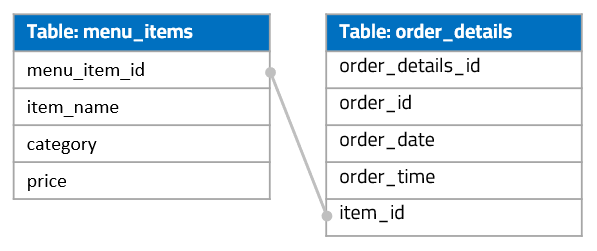

# SQL project: Restaurant Orders

## Project Overview
This SQL project is to explore and analyze a restaurant’s order dataset. The queries are used to understand the popular food items ordered, food category comparison, order size distribution, revenue contribution by menu items, etc.


### Business questions to be explored
1. From all the food items in the menu, what are the average prices and item number for each category?
2. What order size is the common for this restaurant? If we create 4 “buckets” for order size (i.e. 1, 2 – 5, 6 – 10, 11+ items per order), what are the order number for each “bucket”?
3. What are the most popular individual items?
4. What are some of the top revenue items (i.e. items with the most accumulative spending)?


### Tables & Entity-Relationship Diagram (ERD)


## Data Analysis & SQL Codes

* **Query 1**: For each food category in the menu, find the dish number, average price, max / min price.

```SQL
select
    category,
    count(*) as dish_number,
    avg(price) as avg_price,
    max(price) as max_price,
    min(price) as min_price
from menu_items
group by category
```


---
* **Query 2**: For each order, check the number of items ordered. Use subquery to calculate the order number for different item numbers (in several buckets, i.e. 1 items, 2-5 items, 5-10 items, >10 items).


```SQL
select
    case
        when item_number = 1 then 'bucket 1: 1 items'
        when item_number between 2 and 5 then 'bucket 2: 2 - 5 items'
        when item_number between 6 and 10 then 'bucket 3: 6 - 10 items'
        when item_number >= 11 then 'bucket 4: 11 items or more'
        end as item_number_bucket,
    count(*) as total_order_number
from
    (select
        order_id,
        count(order_details_id) as item_number
    from order_details
    group by order_id
    )
group by item_number_bucket
order by item_number_bucket
```


---
* **Query 3**: Find the total number ordered for each menu item, and order them from most to least popular. Use join function to combine order table and menu table.


```SQL
select
    item_name,
    count(*) as order_number
from order_details o
left join menu_items m
on o.item_id = m.menu_item_id
where item_name IS NOT NUll
group by item_name
order by order_number desc
```


---
* **Query 4**: Based on Query 3, also include the total spending for each menu item and category. Order the query results by total spending (from most to least)


```SQL
select
    item_name,
    category,
    count(*) as order_number,
    sum(price) as total_spending
from order_details o
left join menu_items m
on o.item_id = m.menu_item_id
where item_name IS NOT NUll
group by item_name, category
order by total_spending desc
```


---
## Date source 
[mavenanalytics link](https://mavenanalytics.io/data-playground/restaurant-orders?pageSize=10)